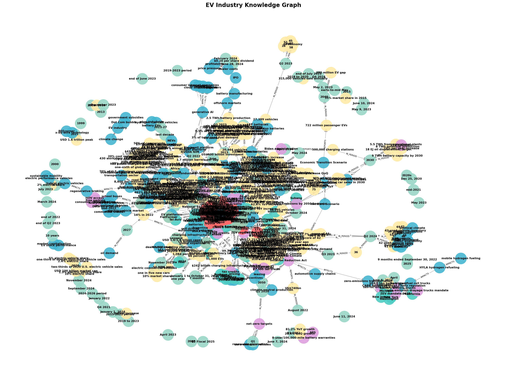

# EV GraphRAG - Knowledge Graph Chatbot

Hệ thống **GraphRAG** (Graph-based Retrieval-Augmented Generation) sử dụng Neo4j để trích xuất và truy vấn knowledge graph từ 70 documents về ngành công nghiệp xe điện (EV) tại Mỹ.

## Mục tiêu

- Trích xuất thực thể (entities) và quan hệ (relationships) từ 70 documents
- Xây dựng knowledge graph trong Neo4j
- Tạo chatbot trả lời câu hỏi phức tạp bằng cách traverse graph
- Đánh giá so sánh giữa **Flat RAG** và **GraphRAG**

## Knowledge Graph



Graph được xây dựng từ 70 documents với:
- **731 nodes**: Company, Metric, Time, Topic, Location, Vehicle, Policy
- **2,674 relationships**: REPORTS, OPERATES_IN, COMPETES_WITH, PRODUCES, IMPLEMENTS

### Node Types

| Type | Mô tả | Ví dụ |
|------|-------|-------|
| Company | Nhà sản xuất xe/linh kiện | Tesla, Ford, BMW, BYD |
| Metric | Chỉ số/số liệu | 268,909 vehicles, 51.3% |
| Time | Thời gian | Q1 2024, 2023 |
| Topic | Chủ đề/khái niệm | EV Sales, Battery |
| Location | Địa điểm/thị trường | US, California, China |
| Vehicle | Mẫu xe | Model Y, Lyriq |
| Policy | Chính sách/quy định | $7,500 tax credit |

### Relationship Types

| Relationship | Mô tả | Ví dụ |
|--------------|-------|-------|
| REPORTS | Company báo cáo Metric | Tesla REPORTS 268,909 vehicles |
| IN_PERIOD | Metric thuộc thời kỳ | 268,909 vehicles IN_PERIOD Q1 2024 |
| OPERATES_IN | Company hoạt động tại | Tesla OPERATES_IN US |
| COMPETES_WITH | Company cạnh tranh với | Tesla COMPETES_WITH BYD |
| PRODUCES | Company sản xuất Vehicle | Tesla PRODUCES Model Y |

## Cài đặt

### 1. Cài dependencies

```bash
pip install -r requirements.txt
```

### 2. Setup Neo4j

```bash
docker run -d --name ev-graphrag-neo4j -p 7474:7474 -p 7687:7687 -e NEO4J_AUTH=neo4j/password123 neo4j:5.15-community
```

### 3. Cấu hình API

Tạo file `config/.env`:

```env
NEO4J_URI=bolt://localhost:7687
NEO4J_USER=neo4j
NEO4J_PASSWORD=password123
USE_NEO4J=true
OPENAI_API_KEY=your_api_key
OPENAI_BASE_URL=your_proxy_url
LLM_MODEL=your_model
```

## Sử dụng

### Bước 1: Extract entities (chạy 1 lần)

```bash
python extract.py
```

Quy trình:
- Đọc 70 documents từ `dataset/`
- Dùng LLM trích xuất Company, Location, Topic, Vehicle, Metric, Policy
- Lưu vào Neo4j với relationships
- Auto-link orphan nodes

### Bước 2: Chat với Knowledge Graph

```bash
python chatbot.py
```

**Lệnh trong chatbot:**
- Nhập câu hỏi → Trả lời từ knowledge graph
- `stats` → Xem thống kê graph
- `quit` → Thoát

**Ví dụ:**
```
Bạn: Tesla bán được bao nhiêu xe trong Q1 2024?
Bot: Tesla bán 268,909 xe trong Q1 2024, giảm 13.3% YoY...

Bạn: So sánh Tesla và Ford
Bot: Tesla giữ vị trí #1 với 51.3% market share...
```

### Bước 3: Benchmark (tùy chọn)

```bash
python benchmark.py
```

So sánh 20 câu hỏi giữa Flat RAG và GraphRAG.

## Kết quả Benchmark

| Metric | Flat RAG | GraphRAG |
|--------|----------|----------|
| Avg time/query | 7.39s | 9.97s |
| Tìm được số liệu cụ thể | Không | Có |

### Ví dụ: "Tesla bán được bao nhiêu xe trong Q1 2024?"

| System | Kết quả |
|--------|---------|
| **GraphRAG** | Tesla bán **268,909 xe** trong Q1 2024, giảm 13.3% YoY |
| **Flat RAG** | Không tìm thấy thông tin cụ thể |

### Bảng so sánh 20 câu hỏi

| # | Câu hỏi | GraphRAG | Flat RAG |
|---|---------|----------|----------|
| 1 | Tesla bán được bao nhiêu xe trong Q1 2024? | 9.5s | 6.0s |
| 2 | Ford doanh số EV thế nào so với Tesla? | 10.9s | 7.1s |
| 3 | Thị phần EV tại Mỹ 2024 của các hãng? | 12.6s | 7.9s |
| 4 | BYD và Tesla cạnh tranh ra sao? | 13.2s | 8.8s |
| 5 | Chính sách $7,500 tax credit ảnh hưởng thị trường? | 9.4s | 9.4s |
| 6 | Hạ tầng sạc EV tại Mỹ thiếu hụt thế nào? | 8.4s | 8.0s |
| 7 | Battery cost đang giảm ở tốc độ nào? | 8.4s | 7.2s |
| 8 | Rivian và Lucid cạnh tranh với Tesla? | 9.7s | 5.8s |
| 9 | Toyota đang tụt hậu về EV? | 10.9s | 6.8s |
| 10 | Trung Quốc thống trị thị trường EV? | 8.2s | 5.0s |
| 11 | Consumer sentiment về EV positive hay negative? | 10.1s | 10.9s |
| 12 | Oil demand thay đổi thế nào với EV? | 10.3s | 11.4s |
| 13 | Charging time là mối quan ngại lớn nhất? | 7.6s | 5.0s |
| 14 | Leasing EV đang tăng trưởng thế nào? | 10.6s | 8.3s |
| 15 | Solid-state battery bao giờ thương mại hóa? | 6.8s | 4.6s |
| 16 | Grid infrastructure có đủ đáp ứng EV? | 9.0s | 8.0s |
| 17 | BMW và Mercedes phát triển EV thế nào? | 9.0s | 6.4s |
| 18 | Doanh số EV Q1 2024 so với Q4 2023? | 9.6s | 4.4s |
| 19 | Pin LFP đang thay đổi ngành EV? | 11.0s | 9.4s |
| 20 | Forecast doanh số EV 2024 và 2025? | 14.3s | 7.4s |

## Phân tích chi phí

| Hạng mục | Giá trị |
|----------|---------|
| Số documents | 70 |
| Thời gian extract/doc | ~8-10s |
| Tổng thời gian extract | ~12 phút |
| LLM calls cho extraction | ~140 calls |

## Cấu trúc dự án

```
ev-graphrag/
├── dataset/              # 70 documents (.txt)
├── src/
│   ├── extractor.py      # Trích xuất entities/relationships bằng LLM
│   ├── graph_store.py    # Neo4j graph storage
│   └── query_engine.py   # Query pipeline + Flat RAG
├── config/
│   └── .env              # Cấu hình API keys
├── output/
│   ├── benchmark.md      # Kết quả benchmark
│   ├── analysis.md       # Phân tích chi phí
│   └── knowledge_graph.png  # Ảnh graph
├── extract.py            # Chạy 1 lần: extract → Neo4j
├── chatbot.py            # Chat với knowledge graph
├── benchmark.py          # So sánh Flat RAG vs GraphRAG
├── docker-compose.yml    # Neo4j Docker setup
├── requirements.txt      # Dependencies
└── README.md             # Tài liệu dự án
```

## Technology Stack

- **Python 3.10+**
- **Neo4j 5.15** - Graph database
- **OpenAI API** - LLM extraction + query
- **Docker** - Neo4j deployment
- **NetworkX** - Graph operations
